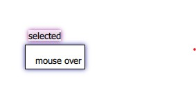

# `alpha`: a graphical theorem prover system

This project implements Charles Sanders Peirce's system for the
graphical representation and manipulation of propositional logic, which
relies on the functional completeness of the connectives
$\{\land, \lnot\}$. Propositions are represented by textual symbols like
$p$ or $q$, while negations are represented by *cuts*, which may contain
other cuts and propositions, without intersecting them. The terms
(propositions and cuts) grouped together (or *juxtaposed*) within a
single cut represent a conjunction of those terms.

## Data Model

The natural data structure for this system is a tree, with propositions
as leaves and cuts as nodes, and a unique conjunction as the root node.
This easily fulfills the given definition of the Alpha existential
graphs. As a succinct reminder, writing the set of propositions/strings
as $P$, a cut around a diagram $D$ as $[D]$, and two juxtaposed diagrams
$D_1D_2$, the set of Alpha existential graphs is the closure of the set of
propositions under the operations of double cut ($D \mapsto [[D]]$) and juxtaposition.

Additionally, we define the *depth* of a node as the number of cuts that
enclose it. Therefore, the root-level conjunction and the cuts within it
have a depth of 0, while the children of the cuts (the terms within
them) have a depth of 1, and so on. This does not map as nicely to the
tree model, since the root conjunction is a special case, but for the
most part can be thought of as the depth of the nodes in the tree.
Marking the root conjunction as being at "depth $-1$" would have been
slightly more convenient in this respect, but would not really be
necessary and may lead to further complications.

The rules of inference are modelled as follows:
-   Erasure: nodes at an even depth can be erased.
-   Insertion: an arbitrary subgraph can be added as a child in a cut of
    odd depth.
-   Iteration: any subgraph $D$ can be added as a child of a node that
    is a descendant of $D$'s parent.
-   Deiteration: any subgraph $D$ that has a structurally identical copy
    $D'$ as a child of any of its ancestors may be deleted.
-   Double Cut: any node $v$ may be separated from its parent $u$, with
    two otherwise empty nodes $v_1$ and $v_2$ being inserted between
    them, such that the ancestries
    $u \to v$ and $u \to v_1 \to v_2 \to v$ are equivalent.
    Alternatively, we may write $D \Leftrightarrow [[D]].$

## Features and Design

The user interface design was inspired by the Vim editor, which
primarily uses keyboard input to change between different modes
(e.g. between navigation and insertion). There are three primary modes:
*navigation*, which disables most interaction and simply allows the user
to navigate the diagram of propositions that has been created; *proof*,
where a user manipulates the existing diagram according to the
established inference rules; and *hypothesis*, which is used to
initialise the diagram before beginning a proof, inserting the necessary
propositions and cuts.

As this is an inherently graphical application, keyboard input can only
bring you so far. However, these controls are in fact sufficient for a
wide variety of manipulations, and for the comfortable use of the
system, without the need for large menus of tiny buttons.

The interface components, labelled in
Figure [1](#fig:labelled){reference-type="ref"
reference="fig:labelled"}, are as follows:

1.  The clipboard, where copied diagrams are stored
2.  The stage, the primary diagram being worked on
3.  The proposition input tool, for inputting propositional formulas for
    translation into diagrams
4.  The mode selection radio buttons
5.  The hint box

In every mode, users are able cycle through the modes with the keys
`m/M`, and zoom in/out with `z/Z`. In hypothesis mode, the user can
click the stage in order to add new terms in the top-level conjunction,
through a simple dialog, as shown in
Figure [2](#fig:dialog){reference-type="ref" reference="fig:dialog"}.
This figure also shows the commands available in hypothesis mode. These
commands are executed by clicking on individuual terms to select them,
and pressing the appropriate key. Terms are highlighted with a drop
shadow to indicate the term under the mouse, and the term that has been
selected, as shown in
Figure [\[fig:glow\]](#fig:glow){reference-type="ref"
reference="fig:glow"}.

The commands in hypothesis mode simply manipulate the selected nodes
freely, as they are not subject to any constraints or inference rules
(beyond the definition of a well-formed diagram). `i` inserts a
proposition within a cut, `d` deletes the node and its children, and
`c/C` add and remove cuts around the selected node respectively. The
keyboard-based input greatly expedites certain common tasks, allowing
fairly complex graphs to be quickly and easily created, with the user's
fingers only infrequently leaving the keyboard. The graph in
Figure [\[fig:complex_graphs\]](#fig:complex_graphs){reference-type="ref"
reference="fig:complex_graphs"} was created with approximately 10 mouse
clicks, including those required for rectifying errors. This framework
also creates room for further navigation shortcuts to be added
(e.g. `hjkl` navigation to select different nodes, or to move around the
diagram in navigation mode).

An extension here that was quite simple to implement is the use of
images as proposition names (which are, internally, file URLs), as
illustrated in Figure [3](#fig:graphic){reference-type="ref"
reference="fig:graphic"}. This is helpful in clearly indicating the
semantics of each proposition that is being considered. The
entertainment and novelty value should also not be overlooked as an aid
to teaching.

Finally, in proof mode, the rules of inference of the Alpha system can
be applied. These include `x` to cut, removing a node via deiteration,
`y` to yank, storing the subtree rooted at the selected node in the
clipboard, and allowing it to be pasted according to the rule of
iteration. A screenshot illustrating this is shown in
Figure [4](#fig:clipboard){reference-type="ref"
reference="fig:clipboard"}.

The other manipulations are `C/c` to insert/remove double cuts, and `d`
to delete arbitrary graphs with even depth. Lastly, `i` enters a special
sub-mode, where the user builds a subgraph in the clipboard and can
insert it into an odd-depth node, as shown in
Figure [5](#fig:insert){reference-type="ref" reference="fig:insert"}.

## Implementation

### Model

The self-contained C99 library `libalpha` contains all the logic required to model
Peirce's Alpha system. Refer to [its documentation](https://github.com/aquohn/libalpha) for further details.

### View

This application was implemented the Qt cross-platform appliccation
framework, which uses C++ for the application code, and provides the Qt
Quick frontend framework. Qt Quick uses QML, the Qt Markup Language,
which allows for simple, declarative definitions of user interfaces.
Unlike the base, CPU-rendered Qt framework, Qt Quick harnesses the GPU
for rendering, providing greater scalability and performance for
graphical applications. It also provides an extensive collection of
standard components that can simplify development. For example, the
scrolling functionality for the stage and clipboard are provided out of
the box by QML's Flickable components.

QML allows the use of JavaScript functions and libraries to implement
the user interface logic. The processing of user input was handled using
JavaScript; most of the code for this can be found in the `AlphaCtx.qml`
file. This JavaScript code in turn calls a C++ engine that uses the
aforementioned C library to manipulate a data model. The integration
between the C++ code in the base Qt framework, and the QML frontend was
relatively painless, because simple data types such as integers, and
lists/arrays of integers, can be passed between the C++ and QML layers
without requiring explicit conversion. However, this required the
maintenance of a map between integer IDs and `alpha_node` structures on
the C++ side, and a similar map between IDs and graphical elements on
the QML side, with substantial associated boilerplate to synchronise the
view and model ID maps.

Another interesting effect of the availability of JavaScript was that
this enabled the use of Prolog DCGs for parsing user input, via the [Tau
Prolog](http://tau-prolog.org/) interpreter, which runs in JavaScript. A
simple DCG for parsing Coq input is found in `alpha_coq.pl`.
Unfortunately, this has not yet been integrated with the library.
